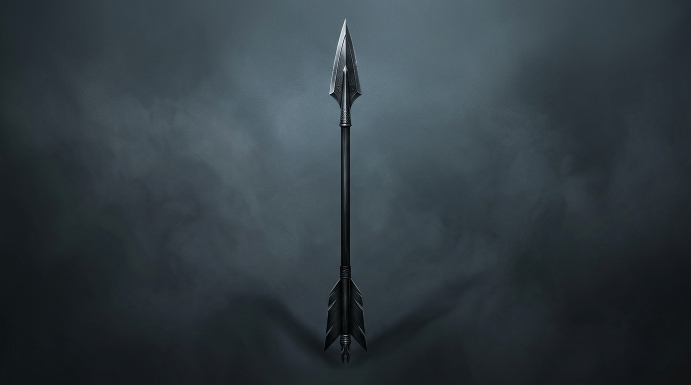

# 幻化箭矢概念参考图 (Arrow Concept Reference)

这是一张专为当前项目《影铸》(ShadowForge) 定制的幻化长矛/箭矢的概念参考图。设计上保持了游戏标志性的哥特阴影（Silhouette）与雾气朦胧的视觉风格。

## 概念设计特点
* **流线型矛头**：摒弃多余的复杂突起，采用极致锋利且符合动力学的叶形收尖。
* **极简枪身**：平直、平滑且干净的箭杆设计，在飞行中能完美保留运动拖尾的速度感。
* **暗灰蓝色调背景**：在高对比度的暗色雾气背景下，角色的幻化武器依然能以锐利的边缘轮廓脱颖而出。

